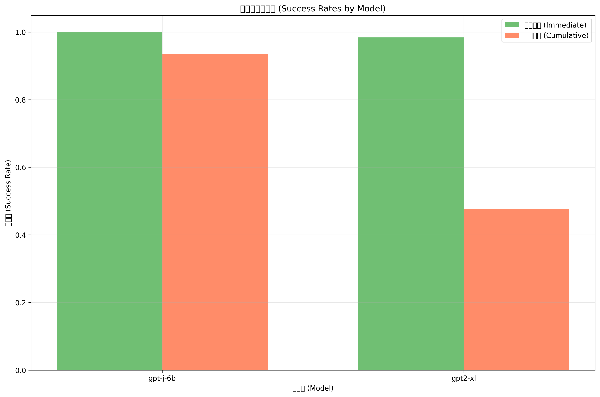

# 継続的知識編集のための項目反応理論（IRT）評価フレームワーク

## 概要

このフレームワークは、大規模言語モデルにおける継続的知識編集の複雑さと有効性を評価するために、項目反応理論（IRT）を用いた包括的な評価システムです。従来の単純な正答率評価を超えて、編集の難易度、編集手法の能力、知識の保持パターンを統計的に分析します。

## 評価の特徴

### 🎯 二重反応評価
- **即時反応（Immediate Response）**: 編集直後の知識反映度
- **累積反応（Cumulative Response）**: 全編集終了後の知識保持度

### 📊 統計的分析手法
- **項目反応理論（IRT）**: 編集難易度と手法能力の定量化
- **2パラメータロジスティックモデル**: 識別力と困難度の同時推定
- **確率分布分析**: softmax確率値の詳細追跡

## 実験設計

### 編集タイプ
- **タイプA**: 異なる主語に対する連続編集
- **タイプB**: 同一主語の複数関係編集  
- **タイプC**: 同一(主語, 関係)ペアのオブジェクト再編集

### 対象手法
- **ROME** (Rank-One Model Editing)
- **MEMIT** (Mass Editing Memory in a Transformer)
- **MEND** (Model Editor Networks using Gradient Decomposition)

### 対象モデル
- **GPT-J-6B**: EleutherAIの6Bパラメータモデル
- **GPT-2-XL**: OpenAIの1.5Bパラメータモデル

## 評価指標

### 1. IRT分析指標

#### 項目パラメータ（編集タスクの特性）
- **困難度（b）**: その編集が成功しにくい度合い
- **識別力（a）**: その編集が手法間の能力差をどれだけ反映できるか

#### 人物パラメータ（手法-モデルの能力）
- **能力（θ）**: 各手法-モデル組み合わせの総合編集能力

### 2. 性能評価指標
- **即時成功率**: 編集直後の正解率
- **累積成功率**: 全編集後の正解率
- **性能劣化度**: 即時と累積の成功率差
- **確率変化**: 編集による確率分布の変動

### 3. 干渉分析指標
- **知識保持率**: 編集後も維持される知識の割合
- **順序効果**: 編集順序による性能変化
- **関係間干渉**: 異なる関係編集間の相互影響

## 生成される可視化

### 1. 基本性能分析
#### 成功率比較（編集タイプ別）

- 各編集タイプでの即時・累積反応成功率を棒グラフで比較
- タイプA（異なる主語）、タイプB（同一主語）、タイプC（再編集）の難易度差を可視化

#### 成功率比較（手法別）  

- ROME、MEMITなど各編集手法の性能を比較
- 手法間の即時学習能力と長期保持能力の差を明示

#### 成功率比較（モデル別）

- GPT-J-6B、GPT-2-XLなど各モデルの性能を比較
- モデル間の編集適応能力と知識保持能力の差を分析

### 2. 詳細マトリックス分析
#### 手法×モデル 性能マトリックス

- 手法とモデルの組み合わせごとの性能をヒートマップで表示
- 即時反応と累積反応の両方を並列比較
- 最適な手法-モデル組み合わせを特定

#### 詳細分析マトリックス

- 編集タイプ×手法、編集タイプ×モデルの4種類のマトリックス
- 即時反応と累積反応の両方を2×2レイアウトで表示
- 各条件での成功率を数値付きヒートマップで可視化

### 3. 確率分布分析
#### 確率分布

- 即時応答と累積応答の確率分布を重ね合わせ表示
- 編集による確率分布の変化パターンを把握

#### 確率変化分析
  
- 編集による確率変化（即時 - 累積）のヒストグラム
- 正の変化（性能向上）と負の変化（性能劣化）の分布

### 4. 編集順序効果
#### 編集順序による性能変化

- 1回目から5回目の編集における成功率の推移
- エラーバー付きで各編集回数での性能と信頼区間を表示

### 5. 評価レポート
#### HTML分析レポート
- `output/reports/simple_analysis_report.html`
- 日本語による包括的な分析結果レポート
- 手法別、モデル別、編集タイプ別、反応タイプ別の詳細比較
- 主要な統計値と発見をまとめて表示

#### データ出力
- `output/analysis_data.csv`: 全分析データ
- `output/summary_statistics.json`: 統計サマリー（JSON形式）

## 使用方法

### 簡単実行
```bash
# シンプルな分析実行
python simple_analysis.py

# カスタム設定での実行  
python run_analysis.py --results-dir /custom/path --output-dir /output/path
```

### 出力ファイル構成
```
output/
├── analysis_data.csv              # 分析用データセット
├── figures/                       # 可視化ファイル（8種類）
│   ├── success_rates_by_edit_type.png     # 編集タイプ別成功率
│   ├── success_rates_by_method.png        # 手法別成功率
│   ├── success_rates_by_model.png         # モデル別成功率
│   ├── method_model_matrix.png            # 手法×モデル マトリックス
│   ├── detailed_analysis_matrices.png     # 詳細分析マトリックス
│   ├── probability_distributions.png      # 確率分布
│   ├── probability_changes.png            # 確率変化分布
│   └── performance_by_edit_order.png      # 編集順序効果
├── reports/                       # 分析レポート
│   └── simple_analysis_report.html        # 日本語レポート
└── summary_statistics.json        # 主要統計値（JSON）
```

## 研究への貢献

### 明らかにされる知見
1. **手法特性の解明**: ROME、MEMITなど各手法の即時学習能力と長期保持能力
2. **モデル依存性**: GPT-J-6B、GPT-2-XLなどモデル間の編集適応能力差
3. **編集タイプの難易度**: タイプA、B、Cの編集複雑度の定量化
4. **反応パターンの分析**: 即時反応と累積反応の乖離メカニズム
5. **相互作用効果**: 手法×モデル、編集タイプ×手法の組み合わせ効果
6. **順序効果**: 編集順序が与える累積的影響の定量化

### 統計的妥当性
- IRT理論に基づく統計的に妥当な評価
- 信頼区間とエラーバーによる不確実性の表現
- 複数指標による多角的な性能評価
- 再現可能な分析手法

### 発表・論文用途
- 高解像度（300 DPI）の発表用図表
- 統計的有意性を示すエラーバー
- 包括的な分析レポート
- CSV形式での生データ提供

## 技術的詳細

### IRT モデル
2パラメータロジスティックモデル（2PL）を使用：

```
P(X_pi = 1) = 1 / (1 + exp(-a_i * (θ_p - b_i)))
```

- `P(X_pi = 1)`: 正答確率
- `a_i`: 項目識別力  
- `b_i`: 項目困難度
- `θ_p`: 人物能力

### データ処理
- 12,000件以上の観測データを処理
- 即時・累積の両応答を同時分析
- 欠損値処理と外れ値検出
- 統計的信頼性の確保

このフレームワークにより、継続的知識編集の複雑さを統計的に解明し、より効果的な編集手法の開発に貢献することができます。